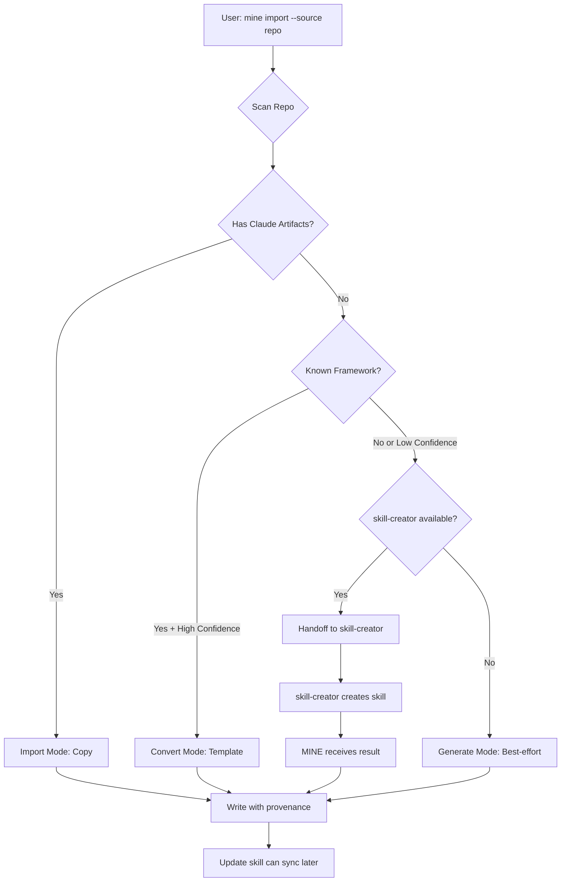

<!--
  MINE — Modular Integration and Normalization Engine
  Crafted for GitHub README polish.
-->

<p align="center">
  
</p>

<div align="center">

# ⛏️ MINE ⛏️  

### Modular Integration and Normalization Engine

</br>

**Import, convert, and continuously sync Claude Code resources from any repository — safely**

</br>

<p>
  <a href="#-what-is-mine">What is MINE?</a> •
  <a href="#-quick-start">Quick start</a> •
  <a href="#-features">Features</a> •
  <a href="#-how-it-works">How it works</a>
  
  <a href="#-safety-by-default">Safety</a> •
  <a href="#-keeping-imports-in-sync-with-mine-mine">Sync</a> •
  <a href="#-requirements">Requirements</a> •
  <a href="#-repository-layout">Layout</a> •
  <a href="#-faq">FAQ</a> •
  <a href="#-quality--testing">Testing</a> •
  <a href="#-roadmap-ideas">Roadmap</a> •
  <a href="#-contributing">Contributing</a> •
  <a href="#-license">License</a>
</p>

</br>

<p>
  
  
  
  
</p>

</div>

---

</br>

<h2 align="center" id="-what-is-mine">✨ What is MINE?</h2>

</br>

**MINE (Modular Integration and Normalization Engine)** turns *messy, inconsistent, “every-repo-is-different”* Claude resources into a **clean, trackable, updatable** Claude Code setup.

MINE ships as **two complementary Claude Code skills**:

| Skill | Purpose | Use it when… |
|---|---|---|
| **`mine`** | **Integrate + normalize**: import Claude artifacts, convert framework patterns (Fabric), generate scaffolds (LangChain / AutoGen), and discover agentic content anywhere in a repo | “Bring this repo’s agents/commands/skills into Claude.” |
| **`mine-mine`** | **Sync + protect**: discover integrations, check upstream, apply updates transactionally, and never clobber local edits | “Keep my imported stuff in sync with upstream.” |

> Think of MINE as: **ingest → normalize → track → keep updated**

---

</br>

<h2 align="center" id="-quick-start">🚀 Quick start</h2>

</br>

### 1️⃣ Install the skills

**Quick install (Recommended):**

Copy and paste into your terminal:

**macOS / Linux:**
```bash
curl -fsSL https://raw.githubusercontent.com/uhl-solutions/MINE/main/scripts/install.sh | bash
```

**Windows (PowerShell):**
```powershell
irm https://raw.githubusercontent.com/uhl-solutions/MINE/main/scripts/install.ps1 | iex
```

**Alternative: Download Release Files**
```bash
# Clone (or download) this repository
git clone https://github.com/uhl-solutions/MINE.git mine
```

> Only use this if you cannot use the auto-installer above.
>
> Download `mine` and `mine-mine` from the Releases page.
> - **Claude app**: Upload the zip directly.
> - **Manual**: Extract to `~/.claude/skills/`.

**Manual / Local Install:**
If you have cloned the repo, you can run the scripts directly:
```bash
# macOS / Linux
./scripts/install.sh

# Windows
.\scripts\install.ps1
```

```bash
cp -r skills/mine        ~/.claude/skills/
cp -r skills/mine-mine   ~/.claude/skills/
cp -r skills/_shared     ~/.claude/skills/
```

</br>

### 2️⃣ Integrate a repo (preview first)

```bash
python3 ~/.claude/skills/mine/scripts/import_assets.py \
  --source https://github.com/user/repo \
  --scope user
```

Apply after reviewing the plan:

```bash
python3 ~/.claude/skills/mine/scripts/import_assets.py \
  --source https://github.com/user/repo \
  --scope user \
  --apply
```

Example: 

Convert Fabric patterns into Claude agents/commands

```bash
python3 ~/.claude/skills/mine/scripts/import_assets.py \
  --source https://github.com/danielmiessler/fabric \
  --scope user \
  --mode convert \
  --apply
```

</br>

### 3️⃣ Keep everything up to date (safe sync)

```bash
# Discover previously integrated repos
python3 ~/.claude/skills/mine-mine/scripts/discover_integrations.py --discover

# Check for upstream changes
python3 ~/.claude/skills/mine-mine/scripts/update_integrations.py --check --all

# Preview an update (dry-run)
python3 ~/.claude/skills/mine-mine/scripts/update_integrations.py --apply --id user-my-repo

# Apply for real
python3 ~/.claude/skills/mine-mine/scripts/update_integrations.py --apply --id user-my-repo --dry-run=false
```

---

</br>

<h2 align="center" id="-features">🤖 Features</h2>

</br>

### 🔴 Import Claude artifacts (from many repo layouts)

MINE can import common Claude Code resources from “wherever they’re stored”:

- **Skills** (`SKILL.md`)
- **Commands** (`*.md`)
- **Agents** (`*.md`)
- **Hooks** (staged safely; never auto-enabled)
- **MCP configs** (`.mcp.json`)
- **Claude documentation** (`CLAUDE.md`)

</br>

### 🟠 Fabric → Claude (full conversion)

If a repository matches Fabric’s `patterns/<pattern>/system.md` layout, MINE can **convert patterns into**:

- **Commands** (simple, single-step patterns)
- **Agents** (more complex reasoning patterns)
- **Skills** (multi-step workflows)

</br>

### 🟡 LangChain / AutoGen (scaffold generation)

For LangChain/LangGraph and AutoGen projects, MINE can **generate scaffolds** that help you run, wrap, and document:

- entry points
- likely agent definitions
- “run” commands + helpful reports

> Note: MINE **does not** automatically semantically transpile arbitrary Python code into Claude logic. It focuses on *integration and normalization*, and produces artifacts meant for review and iteration.

</br>

### 🟢 Agentic discovery (any repo)

MINE can scan *any* repository for “agentic” content (prompts, agent definitions, workflows, tool specs), assign a **confidence score**, and convert high-confidence items into Claude artifacts.

- Enable: `--discover-agentic`
- Tune threshold: `--min-confidence 0.65` (default)

---

</br>

<h2 align="center" id="-how-it-works">🧩 How it works</h2>

</br>

### 🟥 High-level flow



</br>

### 🟧 Scopes: user vs project

| Scope | Destination | Best for |
|---|---|---|
| **User scope** (`--scope user`) | `~/.claude/...` | Your global Claude setup |
| **Project scope** (`--scope project`) | `./.claude/...` | Keeping artifacts with a project |

Typical destinations:

- **User**: `~/.claude/skills/`, `~/.claude/commands/`, `~/.claude/agents/`
- **Project**: `.claude/skills/`, `.claude/commands/`, `.claude/agents/`

</br>

### 🟨 Modes: `import` / `convert` / `generate`

| Mode | What happens |
|---|---|
| `import` | Copies detected Claude artifacts into scope destinations |
| `convert` | Converts Fabric patterns and/or discovered agentic content into Claude format |
| `generate` | Produces a new workflow-oriented skill pack from repo analysis |

---

</br>

<h2 align="center" id="-safety-by-default">🛡️ Safety by default</h2>

</br>

MINE is built around a simple principle: **no surprises**.

</br>

### 🟩 Dry-run is the default

Everything defaults to preview mode:

- `--dry-run` is **on by default**
- set `--apply` (or `--dry-run=false`) to write changes

</br>

### 🟦 Conflict protection (no silent clobbering)

- **Never silently overwrites local modifications**
- Creates timestamped **`.diff` patches** for locally edited files
- Detects overlaps across case-insensitive filesystems (Windows/macOS)

</br>

### 🟪 Path + symlink safety

- blocks `../` traversal
- restricts writes to approved roots for each scope
- skips symlinks by default to avoid path escape risks

</br>

### ⬛ Hooks are never auto-enabled

Imported hooks are staged to a safe location (e.g. `.claude/hooks.imported.<repo>/`) for manual review.

</br>

### ⬜ Best-effort secret redaction during conversion

Agentic conversion includes automated redaction of common credential patterns (tokens, API keys, etc.) via `url_utils.py` so imported artifacts are safer by default.
You must still review generated artifacts.

For a full breakdown of safety guarantees and operator checklists, see [SECURITY.md](SECURITY.md).

---

</br>

<h2 align="center" id="-keeping-imports-in-sync-with-mine-mine">🔄 Keeping imports in sync with mine-mine</h2>

</br>

After integration, the update skill (`mine-mine`) provides a **safe synchronization loop**:

1. **Discover** integrations via markers + registry  
2. **Check** upstream changes (git diff / commit tracking)  
3. **Apply** updates transactionally (atomic writes + rollbacks via `transaction.py`)  
4. **Protect** local edits with conflict detection + `.diff` patches  
5. **Rollback** on failures

Registry + caches live in:

- `~/.claude/mine/registry.json`
- `~/.claude/mine/sources/`

---

</br>

<h2 align="center" id="-requirements">🔧 Requirements</h2>

</br>

- **Python 3.9+**
- **Git 2.0+**
- Optional: **GitHub CLI** (`gh`) for smoother auth and rate limits
- Optional: **Anthropic's `skill-creator` skill** for higher-quality skill generation
- **No external Python dependencies** (stdlib only)

> **💡 Recommended:** Install [Anthropic's `skill-creator`](https://github.com/anthropics/skills) skill for AI-assisted skill authoring. When MINE encounters complex repositories, it can hand off to skill-creator for better results. **skill-creator is recommended but not required** — MINE works fully without it.

Authentication options (in preference order):

1. GitHub CLI (`gh`)
2. `GITHUB_TOKEN` environment variable
3. unauthenticated clone (public repos)

---

</br>

<h2 align="center" id="-repository-layout">📁 Repository layout</h2>

</br>

```text
MINE/
├─ README.md
├─ CLAUDE.md
├─ SECURITY.md
├─ LICENSE
├─ config/
├─ docs/
│  ├─ CHANGELOG.md
│  ├─ CODE_OF_CONDUCT.md
│  └─ CONTRIBUTING.md
├─ scripts/
└─ skills/
   ├─ mine/
   │  ├─ SKILL.md
   │  └─ scripts/
   └─ mine-mine/
      ├─ SKILL.md
      └─ scripts/
         └─ discover/
```

For deeper per-skill documentation:

- `skills/mine/SKILL.md`
- `skills/mine-mine/SKILL.md`

---

</br>

<h2 align="center" id="-faq">🧭 FAQ</h2>

</br>

### 1️⃣ Overview & concepts

<details>
<summary><strong>What problem is MINE solving?</strong></summary>

---

>MINE makes it easy (and safe) to take Claude Code assets from “somewhere else” and bring them into a standardized Claude Code structure — then **keep them updated** without clobbering your local edits.
>
>In plain terms:
>
>- You find a repo with useful prompts/agents/commands/patterns.
>- MINE helps you **import** them into your Claude setup in the right places.
>- It writes provenance/registry info so you can later run updates and get **diff patches** instead of surprises.

---

</details>

<details>
<summary><strong>What kinds of assets can MINE bring in?</strong></summary>

---

>MINE focuses on Claude Code’s common asset types and related config:
>
>- **Skills** (e.g., `SKILL.md`-style skill packs)
>- **Commands** (reusable command markdown)
>- **Agents** (agent definitions in markdown)
>- **Hooks** (handled carefully; see Hooks & Safety below)
>- **MCP config fragments** (staged for manual merge)
>- **CLAUDE.md guidance** (staged for manual review/merge)

>It also supports repo “patterns” and “agentic content” discovery, where it can extract prompt/workflow-like docs and normalize them into Claude-friendly artifacts.

---

</details>

<details>
<summary><strong>What’s “provenance” and why does it matter?</strong></summary>

---

>Provenance is how MINE remembers:
>
>- where an imported artifact came from (source repo + relative path)
>- what destination it was written to
>- (when available) which upstream revision it corresponds to

>That record enables safe updates later: MINE can check upstream changes and decide whether it’s safe to update a given destination file, or whether it should produce a diff patch instead.

---

</details>

</br>

### 2️⃣ Sources & supported inputs

<details>
<summary><strong>Is MINE only for GitHub?</strong></summary>

---

>No — it supports **GitHub URLs** and **local filesystem paths**.
>
>What that means in practice:
>
>- **Remote repo URL (GitHub):** MINE treats the URL as an upstream “source of truth” and can later check for updates from that upstream.
>- **Local path:** MINE scans the directory you point it at and imports/converts what it finds. This is great for repos you’re already working on locally.
>- **Where it lives ≠ what it can do:** MINE’s behavior is determined by **what’s inside the repo** (Claude assets, patterns, framework signals, docs/prompts), not whether it’s hosted on GitHub.

---

</details>

<details>
<summary><strong>Can I use MINE with large repos or monorepos?</strong></summary>

---

>Yes, but the experience depends on repo size and structure.
>
>MINE typically uses guardrails such as:
>
>- skipping common heavy directories (e.g., build artifacts, dependencies)
>- limiting how many files it inspects for discovery-style flows
>- ignoring or de-prioritizing binaries and obviously non-agentic content

>For huge monorepos, it’s often best to point MINE at a relevant subdirectory (or rely on import mode if the repo already contains Claude assets).

---

</details>

</br>

### 3️⃣ Import / Convert / Generate behavior

<details>
<summary><strong>How does MINE decide what to do with a repo?</strong></summary>

---

>MINE scans the repo and then chooses an approach depending on what it finds:
>
>- **Import:** the repo already contains Claude Code assets (commands/agents/skills) → copy them into the right Claude locations.
>- **Convert:** the repo matches known external layouts (e.g., pattern libraries) or contains “agentic” content → normalize into Claude artifacts.
>- **Generate:** the repo has no Claude assets but does have build/docs conventions → synthesize a useful starter “skill pack” and common commands.

>Some setups support an “auto” style flow: scan → propose actions → then you apply.

---

</details>

<details>
<summary><strong>Does it “convert” LangChain/AutoGen apps into Claude agents automatically?</strong></summary>

---

>Not in a “push button → perfectly equivalent agent” sense.
>
>What MINE *does* aim to provide:
>
>- **Framework detection** (LangChain/AutoGen signals and common entry-point patterns)
>- **Scaffolds + reports** that map likely entry points and “agent-like” definitions into Claude-friendly structure
>- Optional **agentic discovery**, which can mine docs/prompts/configs for usable prompt/workflow content and normalize it into agents/commands

>What it *doesn’t* promise:
>
>- Full semantic transpilation of arbitrary application logic (runtime orchestration, state, tool wiring, external services, etc.)
>- A guarantee that the generated artifacts “run” without review and adaptation

>If you want the most direct conversions, pattern-library style sources are typically the cleanest; app frameworks tend to produce **scaffolds + guidance** rather than a full rewrite.

---

</details>

<details>
<summary><strong>What is “agentic discovery” and when should I use it?</strong></summary>

---

>Agentic discovery is for repos that don’t have explicit Claude assets but *do* contain “agent-like” content such as:
>
>- prompt files
>- playbooks / runbooks
>- workflows in docs
>- tool usage instructions
>- “system prompt” style writeups

>MINE will:
>
>- search likely locations (docs, prompts, config-y areas)
>- score/classify candidates as “command-like” or “agent-like”
>- generate normalized Claude artifacts
>- apply **best-effort secret redaction** before writing outputs (you still must review)

>Use it when you suspect “valuable prompts are buried in the repo,” but not already in Claude format.

---

</details>

</br>

### 4️⃣ Output locations & file layout

<details>
<summary><strong>Where does MINE write files?</strong></summary>

---

>MINE can target two common scopes:
>
>- **User scope:** your global Claude Code setup (applies across projects)
>- **Project scope:** a repo-local Claude Code folder (only applies in that repo)

>This is intentional: some assets (like personal utility commands) belong globally; others belong with the project they came from.

>If you’re unsure, a good default is:
>
>- import general-purpose prompts/commands to **user scope**
>- import repo-specific workflows to **project scope**

---

</details>

<details>
<summary><strong>Can I preview what will happen before writing files?</strong></summary>

---

>Yes — MINE is built around previewability.
>
>Common preview outputs include:
>
>- what assets were detected (skills/agents/commands/hooks/config)
>- where they would be placed (user scope vs project scope)
>- what would be skipped due to collisions or ownership
>- what would require manual merge (hooks, MCP config, CLAUDE.md)

>If you like “always dry-run first,” MINE matches that mindset.

---

</details>

</br>

### 5️⃣ Safety, trust, and “what gets executed?”

<details>
<summary><strong>Does MINE run anything from the repo it scans?</strong></summary>

---

>No — MINE is designed to be **read/inspect + copy/convert**, not “execute the repo.”
>
>- Scanning is file inspection and pattern detection.
>- Import/conversion produces markdown/config outputs.
>- Risky assets (especially **hooks**) are not enabled automatically; they’re staged for manual review.

>You should still review anything you import, but MINE is built to avoid “surprise execution.”

---

</details>

<details>
<summary><strong>How are hooks handled?</strong></summary>

---

>Hooks are treated as high-risk because they can execute code.

>MINE’s approach is intentionally cautious:
>
>- Hooks are typically **staged** into an “imported” area rather than being dropped directly into an active hooks directory.
>- The README usually expects you to **manually review and merge** any hooks you want.
>- This ensures you don’t accidentally enable executable behavior from a repo you just scanned.

>If you want to use hooks from an imported repo: review them line-by-line, confirm what they do, then intentionally move/enable them yourself.

---

</details>

<details>
<summary><strong>How does MINE handle MCP configuration?</strong></summary>

---

>MCP config is treated carefully because it can change tool connectivity and behavior.

>Typical behavior:
>
>- MINE **does not blindly merge** into your active MCP config.
>- Instead it stages the imported config as a separate **imported fragment** for you to review and merge manually.

>This reduces the chance of breaking an existing MCP setup or unintentionally enabling new tool access.

---

</details>

<details>
<summary><strong>What happens with CLAUDE.md from an imported repo?</strong></summary>

---

>`CLAUDE.md` often contains repo-specific instructions and conventions.

>MINE treats it like “docs to review,” not “docs to auto-apply”:
>
>- It stages the imported instructions so you can **diff/merge** with your existing conventions.
>- This avoids silently changing your working norms across projects.

>A good workflow is to skim the imported `CLAUDE.md` and copy only the parts you actually want.

---

</details>

<details>
<summary><strong>Does MINE redact secrets?</strong></summary>

---

>MINE includes a best-effort redaction step during certain conversions/discovery flows, intended to catch common credential patterns.

>That said:
>
>- Redaction is **not a guarantee**.
>- You should still review generated artifacts before sharing or committing them.
>- If the source repo contains secrets, address that at the source (remove secrets from history, rotate keys, etc.).

>Think of redaction as “seatbelt,” not “airbag + roll cage.”

---

</details>

</br>

### 6️⃣ Updates, syncing, and conflicts

<details>
<summary><strong>How do updates work?</strong></summary>

---

>Updates are handled by the companion skill (`mine-mine`).

>At a high level:
>
>- it uses the provenance/registry to know “what belongs to which repo”
>- it checks upstream changes (typically via a cached clone/fetch)
>- it compares upstream content vs your current local destinations
>- it applies safe updates and generates **diff patches** when you have local modifications

>The goal is: **keep imported assets current** without turning your local edits into casualties.

---

</details>

<details>
<summary><strong>Will it overwrite my local changes?</strong></summary>

---

>By default: **no**.

>MINE is conservative and review-first:
>
>- **Dry-run workflow:** You can see what would happen before it writes anything.
>- **No silent clobbering:** If a destination file exists and is **locally modified**, MINE will **skip** overwriting it.
>- **Merge assistance:** If an upstream update would change a file you’ve edited, MINE generates a **`.diff` patch** so you can merge intentionally.
>- **Optional overwrite (explicit):** If you explicitly opt into overwriting, MINE can do so with **backup behavior** for rollback safety.

>Net: MINE tries hard to preserve your edits and make conflicts obvious and recoverable.

---

</details>

<details>
<summary><strong>Will updates delete files if they were removed upstream?</strong></summary>

---

>MINE can detect “upstream removed this artifact,” but deletion is handled conservatively.

>Typical supported policies include variants like:
>
>- **skip** deletion (never delete)
>- **ask** / review-based deletion
>- **soft** deletion (retain a backup / move aside)
>- **hard** deletion (explicit, high-confidence mode)

>If you’re risk-averse, choose a policy that requires review or preserves backups.

---

</details>

<details>
<summary><strong>What if two different repos try to write to the same destination path?</strong></summary>

---

>MINE tries to prevent “ownership collisions.”
>
>- It tracks which integration “owns” which destination files.
>- If a new import would collide with an existing owned path, MINE should block or force you into an explicit resolution path rather than silently mixing sources.

>This keeps updates sane and prevents one upstream from overwriting another’s artifacts.

---

</details>

</br>

### 7️⃣ Platform & maintenance

<details>
<summary><strong>Is MINE safe on Windows/WSL?</strong></summary>

---

>MINE is path-safety conscious and platform-aware, including handling common Windows/WSL pitfalls like:
>
>- path normalization
>- safe resolution (avoiding path traversal)
>- case-sensitivity edge cases (case-only renames)
>- “write only inside approved roots” behavior

>You should still sanity-check destinations, but cross-platform support is a design goal.

---

</details>

<details>
<summary><strong>Where does MINE cache cloned repos, and can I clear it?</strong></summary>

---

>The update system keeps cached sources so it can check upstream changes efficiently.
>
>- There’s typically a **sources/cache directory** under MINE’s registry area.
>- Cache eviction/cleanup is usually available as part of maintenance behavior (or by deleting the cache directory if you’re sure you won’t need it).

>If disk usage grows, clearing the cache is usually safe; you’ll just re-fetch on the next update check.

---

</details>

<details>
<summary><strong>How do I "uninstall" or remove an integration?</strong></summary>

---

>Use the `--unregister` command to remove an integration from the registry:

```bash
# Preview what would be removed (dry-run default)
python3 ~/.claude/skills/mine-mine/scripts/discover_integrations.py \
  --unregister user-my-repo

# Remove from registry only (keep files on disk)
python3 ~/.claude/skills/mine-mine/scripts/discover_integrations.py \
  --unregister user-my-repo \
  --dry-run=false

# Remove from registry AND delete imported files (with backups)
python3 ~/.claude/skills/mine-mine/scripts/discover_integrations.py \
  --unregister user-my-repo \
  --delete-files \
  --dry-run=false
```

>**Safety features:**
>
>- Locally modified files are skipped by default (use `--force` to include them)
>- All deleted files receive `.unregister-bak.<timestamp>` backups
>- Staged imports (hooks, MCP, CLAUDE.md) are also cleaned up
>- Transactional: rolls back all changes if any operation fails

---

</details>

<details>
<summary><strong>Does MINE change licensing or attribution for imported content?</strong></summary>

---

>No. MINE moves/converts content; it doesn’t rewrite licensing obligations.

>If you import assets from another repo:
>
>- keep the original license in mind
>- preserve attribution if required
>- don’t assume “because it’s a prompt” that it’s automatically free to reuse in all contexts

>When in doubt, treat imported assets like any other third-party source code/docs.

---

</details>

<details>
<summary><strong>What should I do if something looks wrong after import/convert?</strong></summary>

---

>A safe debugging checklist:
>
>- Re-run the scan and confirm what MINE detected vs what you expected.
>- Check for collision/ownership warnings (files skipped, staged, or blocked).
>- Look for generated `.diff` patches (they often explain why something didn’t overwrite).
>- Prefer rerunning in preview/dry-run mode until the plan matches your intent.
>- If hooks or MCP config are involved: confirm you didn’t accidentally enable something you meant to stage.

---

</details>

---

</br>

<h2 align="center" id="-quality--testing">🧪 Quality & Testing</h2>

</br>

MINE maintains a dual-layered testing strategy to ensure safety without sacrificing agility.

- **Safety-Critical Coverage (100%)**: Core modules for redaction, path safety, and atomic I/O are exhaustively tested.
- **Broad Project Coverage (50%+)**: Automated CI tracks every line across the entire `skills/` tree, including orchestration and CLI logic.
- **Cross-Platform CI**: Every commit is verified on Windows, macOS, and Linux to catch platform-specific bugs.

> See [`docs/METRICS.md`](docs/METRICS.md) for detailed coverage reports and quality metrics.

Run tests locally:
```bash
python3 -m pytest tests/ -v --cov=skills
```

---

</br>

<h2 align="center" id="-roadmap-ideas">🗺️ Roadmap ideas</h2>

</br>

- More framework adapters (“normalizers”) beyond Fabric/LangChain/AutoGen
- Richer agentic discovery rules and provenance visualization
- Optional interactive TUI for scan → review → apply
- First-class “pack publishing” helpers (versioning, changelogs)

---

</br>

<h2 align="center" id="-contributing">🤝 Contributing</h2>

</br>

We welcome contributions! Please see [CONTRIBUTING.md](docs/CONTRIBUTING.md) for details on how to get started, run tests, and submit PRs.

This project adheres to a [Code of Conduct](docs/CODE_OF_CONDUCT.md). By participating, you are expected to uphold this code.

### Quick tips for new normalizers

If you’re adding a new normalizer (framework adapter), aim for:

- deterministic scans
- dry-run parity with apply
- clear provenance + reversible writes
- safe defaults (especially around hooks and secrets)

---

</br>

<h2 align="center" id="-license">📄 License</h2>

</br>

MIT License. See [LICENSE](LICENSE).

**Copyright (c) 2025 uhl.solutions**

---

</br>

<div align="center">

Made with ♥️ by **uhl.solutions**.

</div>
